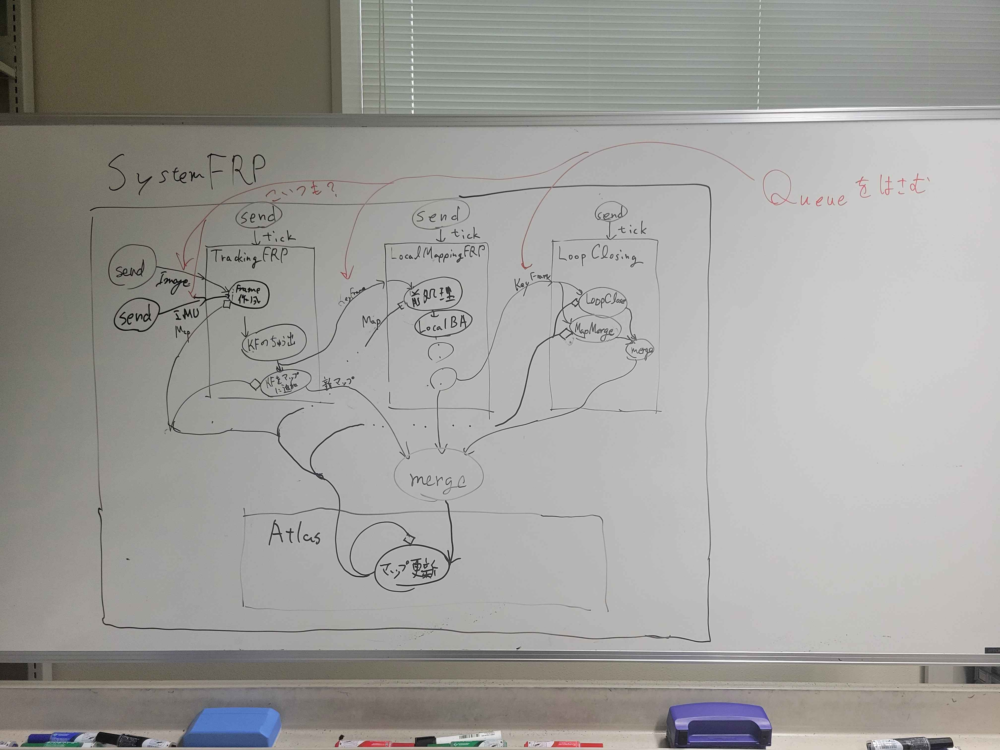

# 2024-10-16ゼミメモ

## 目次

- ポスターについて
- 今週やったことの概要
- FRP ORB-SLAM3の設計
- 行き詰まった部分の対処法を考えてた（後述
- FRP化の手順に付いて
- 今後の作業、相談等

## ポスターについて

レビューをもらったので、この場で話すことがなければ飛ばしてOK。
最後に話してもOK。

## 今週やったことの概要

- ポスター
- FRP ORB-SLAM3の設計
- 行き詰まった部分の対処法を考えてた（後述
- FRP化の手順に付いて

## FRP ORB-SLAM3の設計

Tracking, LocalMapping, LoopClosingの３種は少なくともFRPで包んでやる必要がある。

Atlasを完全にFRP化する。

SystemでTracking, LocalMapping, LoopClosing, Atlasと外界のつなぎ込みをする事になりそう。

### Atlasについて

Atlasは全てのMapと、KeyFrameDatabaseを所有している。

用途としては

- 現在マップをAtlasから取得
- マップ一覧を取得
- 全キーフレームを取得
- KeyFrameを追加

等

AtlasのFRP化は、Mapなどのデータ構造への副作用をAtlas上のCellLoopで表現するのが目的。

## 簡単なネットワーク図

## 行き詰まった部分

主にMap, KeyFrame, MapPointのデータ構造について。

Map、KeyFrame、MapPointはお互いにポインタ参照を持っている。
そのためデフォルトのコピーコンストラクタではFRPに対応できない。

> コピーしたい理由：副作用を起こす関数を呼び出す前にコピーを取るなどするため。

なので、コピーコンストラクタを時前実装するなり、ほかメソッドとして実装するなりする必要がある。

- 手法１：コピーコンストラクタを実装
  - メモリ計算量が跳ね上がると思われる
  - 実装自体は可能そう
    - 簡略化したもので1対多は確認済み、多対多は未確認
- 手法２：３つのデータ構造をポインタでの相互参照からidで保持するなど、コピー可能なものへ改造を施す
  - Relational Data Baseのような手法
  - 単純にこれだけだと全てのコードを再実装する必要が出てくる
  - 改造された新しいデータ構造ともともとのデータ構造の相互変換を実装するなどすれば影響範囲を狭められる
    - 相互変換可能かどうかはわからないができる気がしている
  - メモリ計算量はまし？そんなことはないかも

## FRP化の手順について

FRP化をしていくうえで、段階的に現状のコードから副作用の引き剥がしや実際のFRP化を行う手順を考えていた。

やらなければいけないこととしては

- データ構造の改造
- メンバ変数をグローバル変数のように扱うメソッド呼び出し群の修正
  - メンバ変数が状態なのか計算メモなのか把握する（特に状態）
- AtlasのFRP化
- Tracking、LocalMapping、LoopClosingをFRPで包む
- SystemをFRP化してつなぎこみ

### 実装するうえでメンバ変数について詳しく

TODO

### 今後の作業、相談など

- 現状のシステムの計測 → データ構造の改造方法を考えるため
  - 計算量（動くかどうか）と実装量はどう秤にかければいいですか？
- リファクタリングをしながらFRP化の手順の2の部分を実際に進めていきたい
  - 解読の手助けになると思っている。
