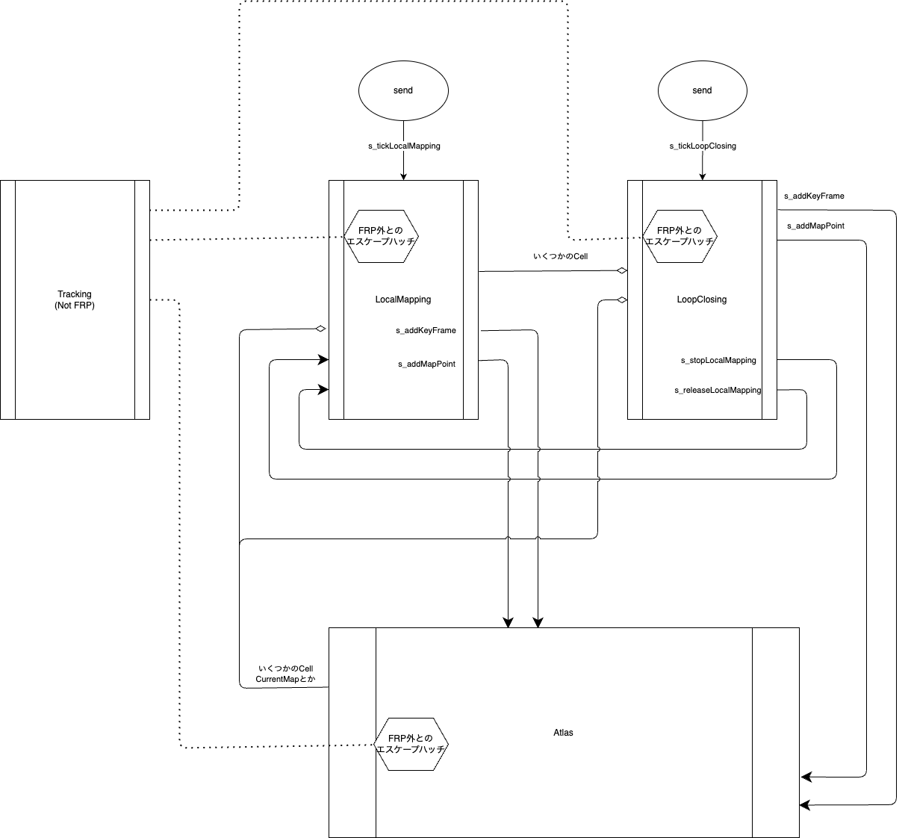

# 2024-11-13 報告会

## 全体

- リファクタリング
  - デバッグ機能の削除
  - セーブ機能の削除
  - unusedなメンバや関数の一掃
- リーディング
  - アプリケーション全体のネットワークの構築に焦点を当てて、publicな関数や変数を外部で使用している場所度を精査
- ネットワークの草案を作成

### ネットワークについて

簡易の全体ネットワーク図

LocalMapping

LoopClosing

Atlas

## KATO

- PC２代目の環境構築
  - ビルド時間が20分から5分ヘ短縮された
- LocalMappingとSystemのパブリックなメンバ変数を精査
  - ネットワークについて考えるのに必要な情報を得るため
  - それぞれについてunusedなものを消すなどのリファクタリング
- デバッグ機能の削除

### 相談

- Streo + IMUなど特定パターンのみ対応しそれ以外のパターンをすべて消してしまいたい
  - 我々の研究の目標はORB_SLAM3を完全に移植することではなく、 並列FRPを用いたVisual SLAMのプロトタイプを実装すること
  - プロトタイプの時点で全てのカメラタイプを網羅することは考えなくて良いはず。
  - 複数のカメラタイプを想定することにおよってコードの煩雑化、スパゲティ化がひどいので、
    Stereo + IMUなど特定パターンについてのみ考えることでシステムやネットワークをシンプルにしたい

## FUJIWARA

### やったこと

今週はFRP化のために未使用の機能などを削除していった。また、ドキュメントの整備も行った

1. ドキュメントの作成
   - オリジナルのREADMEを残してビルド手順等を記載したREADME.mdを作成した
2. 未使用の機能の削除
   - Atlasのセーブ機能は使用しない方針なので、それに関連する機能を削除した
   - 具体的にはPreSave/PostLoadとクラスのシリアライズの機能の削除を行った
3. リファクタリング
   - 未使用変数や条件式の整備などを行った
   - 責務の異なる処理を適切な場所に配置した

## YAMAKI

## 会内で話したこと
