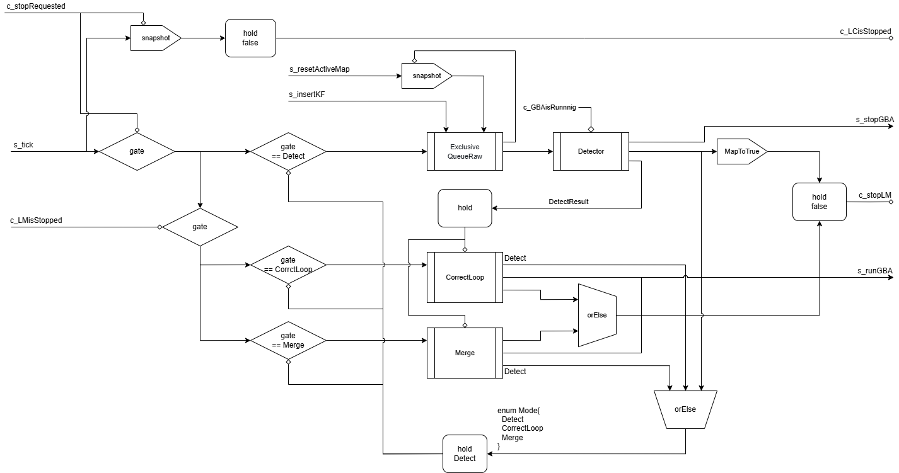

# 2024-11-20 報告会

## 全体

- リファクタリング
  - KeyFrame, MapPoint, Mapなどこれまであまり触っていなかった部分についてunusedなものを大掃除（-1500行
- ネットワーク設計
  - GBA周り
    - GBAのスレッドを管理するモジュール（クラスタを作成
  - Atlasの扱いの大幅な変更
    - Atlas自体はセルの値として取り回す方針
    - 各モジュールから新しいAtlasを受取り更新するモジュールを作成
  - Queueの仕組みを変更
    - メモリを参照してネットワークを接続しないようにしていたが、その必要がないのでキューをセルの値として保持するように
- 実装
  - Queueの修正
  - GBAManager: GBAを管理すモジュール
  - ImmutableAtlas: 永続データ構造のような形のAtlas
    - 保持しているマップのポインタが変更された新しいImmutableAtlasを返すなど
    - ただし所持しているMapに対し副作用が行われたとしても感知しない
  - AtlasManager
    - ImmutbleAtlasを各モジュールから受取り、セルに格納し、グローバルループを通して各モジュールに提供する

### ネットワークについて

### ImmutbleAtlasとAtlasManager

#### Atlas

内部で複数のマップを保持し、それとは別に現在用いているマップのポインタを保持してそれに対する操作を提供している

また、マージによって不必要になったマップを複数保持し、それらの追加と削除を行う機能も提供する。

#### ImmutbleAtlas

Atlasとほぼ同じ機能を持っているが、ImmutableAtlasに変更を加える操作については、変更後のImmutableAtlasを返し
元のImmutableAtlasについては変更をしないようになっている

#### AtlasManager

ImmutableAtlasをホールドして管理するネットワークを構築する。

変更後のアトラスを持って発火するストリームをn個受け取り、内部でマージした後にホールドしたセルを外部に出力する。

### GBAManager説明

#### 状態

内部的に3つの状態を保持する

- c_updateInfo
  - GBAが終了し、マップの更新が可能かをマップのポインタのoptionalで保持するセル
- c_runInfo
  - GBAを要求された最新のマップのポインタをoptionalで保持するセル
- c_thread
  - 現在動作しているスレッドのポインタと、スレッドの処理を中断させるフラグをoptionalで保持するセル

#### 入力

入力として以下のストリームとセルを受け取る

- s_tick
  - 発火した際に、c_runInfoにGBAをするマップが存在し、かつc_updateInfoに更新するべきマップが存在しない場合にGBAを起動させる
- s_stopGBA
  - 発火した際にc_threadで走っているスレッドを中断した後joinして終了まで待つ
  - c_threadをnoneで更新する
- s_runGBA
  - GBAを行うマップの情報を持って発火し、その際にc_runInfoをその情報で更新する
- c_isLMStopped
  - ローカルマッピングが停止しているかを保持するセル

#### 出力

出力として以下のストリームが存在する

- s_stopLM
  - マップの更新処理を行う際にLMを停止させるために発火させるストリーム
- s_releaseLM
  - 停止させたLMを復帰させるために発火させるストリーム

#### 動作

動作は主にs_tickによって行われる。動作は以下のようになっている。

- c_runInfoに情報がある
  - c_updateInfoに情報がない場合
    - 新たにスレッドを起動する
    - この際、別スレッドが走っているなら止めてから起動する
  - c_updateInfoに情報がある
    - c_isLMStoppedがfalse
      - LMに対して停止を要求するストリームを発火させる
    - c_isLMStoppedがtrue
      - 情報を用いてキーフレームやマップポイントの情報を更新する
      - 更新後、LMの再開を要求するストリームを発火させる
- c_runInfoに情報が無い
  - c_updateInfoに情報が無いなら何も行わない
  - そうでないなら、上と同じ動作を行う

### Queueについて

名前はExclusiveQueueRaw

理由は

- 単純なpushとpopだけではなく、キューそのものの置き換えも提供するため
- 入力ストリームすべてが別トランザクションで発火することを望んでいるため

入力

- s_exchange: キューを置き換える。
  - 用途としてはResetActiveMapで特定のマップに所属するキーフレームをキューから削除するなど
- s_clear: キューを空にする
- s_push: キューにアイテムを追加
- s_pop: キューの中身を一つ取り出す

出力

- s_popped: s_popが来て、中身が空でなければアイテムを持って発火
- c_length: キューの長さを持ったセル
  - 用途としては、ローカルマッピングでキューの中身が多ければローカルBAなどの処理をスキップして次のループを迎えるなど
- c_queue: キューそのものを持ったセル
  - ResetActiveMapなどで使う

## KATO

やったこと

- リファクタリング
- GBAマネージャの設計
- Atlasの扱い方について設計
- LocalMappingの設計とインタフェースの実装を進めた

反省点

- LocalMapping周りの設計があまりできなかった

## FUJIWARA

### やったこと

- イミュータブルなアトラスの設計と実装
- 上記のアトラスを管理するFRPで書かれたマネージャーの設計と実装
- GBAをFRPで実行するクラスの実装

### やってること

- ExclusiveQueueRawの実装
- TrackingのFRPラッパの設計と実装

## YAMAKI

### やったこと

- unusedな変数や関数の削除（Reset周り、KeyFrameDatabaseなど）
- ループクロージングの詳細なネットワーク設計 - ストリームの細分化 - Detect情報の受け渡し
  
- ループクロージングのインターフェイスの作成

## 話したこと

- Queueについて
  - TrackingをFRP化した場合、ResetActiveMapとInsertKFが同一トランザクションで起こるのか否か調査・考える必要あり
- LoopClosingFRPについて
  - c_countMapとc_currentMapはc_atlas(ImmutableAtlas)からのsnapshotで取得する?
  - Queue周りの軽微な修正
  - holdするデータにcurrentKFを含める
