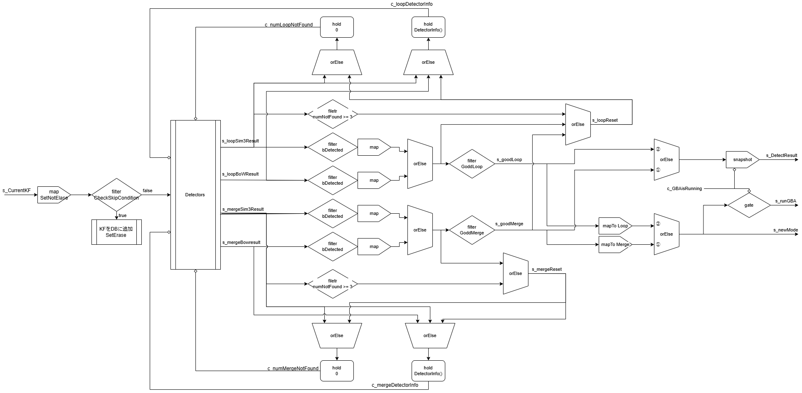

# 2024-12-11 報告会

## 全体

### デバッグで分かった問題点

- Dockerで動かしているのにも関わらず、環境によって動作が違う。
- listenの有無で動作が変わる？
  - LMでKeyFrame作成ができていなさそうだったので、LocalMappingにlistenを付け加えたら動くようになった。
  - その後、listenを外したらkeyFrameを作成しなくなった。

## kato

## fujiwara

## yamaki

### やったこと

- デバッグ
- CorrectLoopのネットワーク構築（現在進行中）

### Detectorのネットワーク

